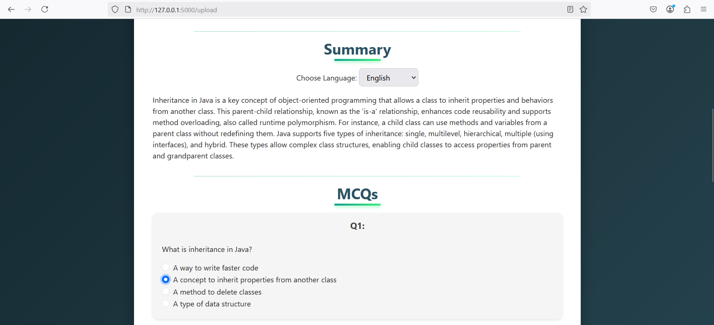

# AI Video Summarizer

[](https://www.python.org/)
[](https://flask.palletsprojects.com/)
[](https://openai.com/)
[](LICENSE)

---

## ✨ Description
**AI Video Summarizer** is a Flask-based web application that lets users upload two videos, extracts the audio, transcribes it to text, intelligently analyzes the content using OpenAI's GPT models, and then automatically generates a **summarized video** containing the best clips from both videos.

---

## 🚀 Main Features
- Upload two videos easily via a web interface.
- Automatic **video splitting** and **speech-to-text** transcription.
- Summarization and clip selection powered by **OpenAI GPT-4o**.
- Auto-combine best clips into one final summarized video.
- Simple **Login authentication** system (MySQL based).

---

## 📋 Table of Contents
- [Project Structure](#-project-structure)
- [Installation Requirements](#-installation-requirements)
- [Installation Steps](#-installation-steps)
- [Usage](#-usage)
- [Configuration Instructions](#-configuration-instructions)
- [Screenshots](#-screenshots)
- [Author / Credits](#-author--credits)
- [License](#-license)

---

## 📁 Project Structure
```plaintext
ai-video-summarizer/
  app.py
  LICENSE
  requirements.txt
  speech_to_text.py
  utils.py
  input/
    summary_prompt.txt
    text_sampling_prompt.txt
  static/
    processed/
      best_clips.mp4
      summary_prompt.txt
      summary_result.json
      text_sampling_result.json
  templates/
    login.html
    output.html
    upload.html
  screenshots/
    login.png
    upload_videos.png
    output1.png
    output2.png
    output3.png
    output4.png
```

---

## 📦 Installation Requirements

| Package | Description |
| :--- | :--- |
| Flask | Web framework for Python |
| moviepy | Video editing module |
| SpeechRecognition | Speech-to-text processing |
| openai | OpenAI API access for GPT models |
| mysql-connector-python | Connect and interact with MySQL database |

> **Note**: Specific versions not pinned. Use latest compatible versions.

---

## 🛠️ Installation Steps

1. **Clone the Repository**
    ```bash
    git clone <repository-url>
    cd ai-video-summarizer
    ```

2. **Create & Activate Virtual Environment**
    ```bash
    python -m venv venv
    source venv/bin/activate  # Windows: venv\Scripts\activate
    ```

3. **Install Dependencies**
    ```bash
    pip install -r requirements.txt
    ```

4. **Set Up MySQL Database**
    ```sql
    CREATE DATABASE ai_video_summarizer;
    CREATE TABLE users (
        id INT PRIMARY KEY AUTO_INCREMENT,
        username VARCHAR(255) UNIQUE NOT NULL,
        password VARCHAR(255) NOT NULL
    );
    INSERT INTO users (username, password) VALUES ('admin', 'admin');
    ```

5. **Set OpenAI API Key**
    ```bash
    export OPENAI_API_KEY='your-openai-api-key'
    ```

6. **Run the Application**
    ```bash
    python app.py
    ```

---

## ⚙️ Configuration Instructions

| Item | Location | Notes |
| :--- | :--- | :--- |
| **Database Config** | `utils.py` | Update MySQL host, user, password if needed |
| **OpenAI API Key** | Environment Variable | Or modify `utils.py` if necessary |
| **Static Output Directory** | `static/processed/` | Summarized videos and JSON results stored here |

---

## 🔥 Usage

- Open [http://localhost:5000/](http://localhost:5000/) in your browser.
- Log in with your credentials.
- Upload two videos.
- Wait for automatic processing.
- Download or view the final summarized video.

---

## 🖼️ Screenshots

| Login Page | Upload Videos Page |
| :---: | :---: |
|  |  |

|             Output Summarized Clips              |             Output Summarized Clips              |
|:------------------------------------------------:|:------------------------------------------------:|
|  |  |
|  |  |

---

## 👨‍💻 Author / Credits

**Devid Mazeeta**

---

## 📜 License

This project is licensed under the [GNU General Public License v3.0](LICENSE).

---
